# Complex Multistage Generators

When writing large sets of generators and languages that build on top of each other it can be a challenge to understand what is going on during generation. Especially defining generator priorities to order them correctly can get messy quickly. If not taken care of it can happen that a lot of cross generator dependencies are introduces just for the sake of making sure generators are executed in the correct order. A pattern to counter this is to define logical checkpoint/barriers (not to be mistaken with the checkpoints you can define in a generation plan in MPS) in your generator priorities. Priorities are the assigned relative to this barriers. The barriers represent level of abstraction, If a generator requires a certain level of abstraction as input its priorities are defined according to that. It is important a singe generator is picked for each of these barriers to have single point where these dependencies are relative to. This makes debugging much easier. We will use an example from mbeddr below to illustrate this.

## Mbeddr Example

While mbeddr itself uses over 30 generators in total their priorities are in most cases easy to unterstand. Most of the generators are pretty isolated from the point of view and most of them only define that they need to be run before the the `modules.gen` generator. In this example we will look at 3 logical stages of mbeddr all of them on different layers of abstraction.  We will start explaining them from the bottom to the top.

 

### mbeddr.modules.gen layer

This is the lowest layer of abstractions it assumes that the input is mbeddr C99 representation. This input is basically a simplified version C99 without headers and with some other minor adaptions. This generator transforms its input into *real* C99 code with `.c` and `.h` files. If language extension provides a higher abstraction than this then it defines its generator priorities  relative to this generator. One example here is the `mbeddr.unittest` language. 

### The middle layer 

This layer contains all sorts of higher level abstractions than C. They are all independent from each other but at some point they need to generate down to mbeddr C. This needs to happen before the `modules.gen` generator is executed because it assumes that the input is C. All of the languages define their priority relative the `modules.gen` generator. Debugging if the order is correct is easy through this. If transformations are not applied correctly it is easy to check the generation plan for a model to see if all the generators reducing the abstraction to C have been executed before the `modules.gen` generator. 

### Higher Level Abstractions

The top layer in our example is a language that integrates state-machines and components. Its priorities are only set relative to the two generators it extents: `mbeddr.statemachines` and `mbeddr.components`. Since these generators itself have priorities that require them to be executed before the `modules.gen` generator is run no additional priorities are required. 

